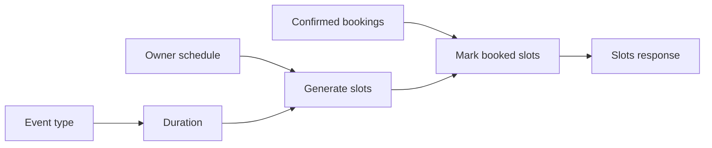

# Project MVP Plan

## Обзор

«Запись на звонок» — упрощенный сервис бронирования времени по мотивам Cal.com. Проект выполняется в подходе Design First: сначала фиксируем внешнее поведение и API-контракт, затем отдельно реализуем frontend и backend по этому контракту.

В MVP нет регистрации и авторизации. Владелец календаря один и заранее задан в системе. Этот профиль по умолчанию используется в owner/admin части. Гости бронируют слоты без аккаунта и без входа.

## Стек

| Слой | Технология |
|------|-----------|
| API Contract | TypeSpec + OpenAPI |
| Frontend | React + Vite + Mantine UI + TypeScript |
| Backend | NestJS + Prisma + TypeScript |
| Database | PostgreSQL |
| Testing | Jest, Vitest + Testing Library |
| Infra | Docker Compose |

## MVP Scope

### Входит в MVP

- TypeSpec-спецификация как единый источник правды для frontend и backend
- Один заранее заданный владелец календаря
- Owner/admin сценарий без авторизации:
  - создание типов событий;
  - просмотр списка типов событий;
  - просмотр предстоящих встреч по всем типам событий.
- Guest сценарий без авторизации:
  - просмотр публичного списка видов брони;
  - выбор типа события;
  - просмотр свободных слотов на ближайшие 14 дней;
  - создание бронирования на свободный слот.
- Проверка занятости: на одно время нельзя создать две записи даже для разных типов событий
- UI по скриншотам из `screens/`

### Не входит в MVP

- Регистрация и логин
- JWT, cookies, password reset
- Несколько владельцев календарей
- Редактирование и удаление типов событий
- Редактор расписания
- Интеграции с внешними календарями
- Email-уведомления
- Отмена бронирования по ссылке

## Роли

### Владелец календаря

Владелец не регистрируется и не входит в систему. Backend всегда использует заранее заданный owner profile.

Владелец может:
- создавать типы событий;
- видеть список созданных типов событий;
- видеть страницу предстоящих встреч, где собраны бронирования всех типов событий.

### Гость

Гость не создает аккаунт.

Гость может:
- посмотреть страницу с видами брони;
- выбрать тип события;
- открыть календарь и выбрать свободный слот в ближайшие 14 дней;
- создать бронирование, указав имя и email.

## Доменные сущности

### Owner

Заранее заданный владелец календаря.

```
id          string
name        string
email       string
timezone    string
createdAt   datetime
updatedAt   datetime
```

### EventType

Тип события, который владелец предлагает гостям.

```
id                string
ownerId           string
title             string
description       string?
durationMinutes   int
createdAt         datetime
updatedAt         datetime
```

Правила:
- `title` обязателен;
- `durationMinutes > 0`;
- в MVP создание доступно без auth, потому что owner один.

### Slot

Расчетный интервал времени, доступный или занятый для бронирования.

```
startTime   datetime
endTime     datetime
status      free | booked
```

Правила:
- слоты формируются на ближайшие 14 дней, начиная с текущей даты;
- слот должен полностью помещаться в расписание владельца;
- статус `booked` означает, что на `ownerId + startTime` уже есть подтвержденная бронь.

### Booking

Бронирование гостя на слот.

```
id            string
eventTypeId   string
ownerId       string
startTime     datetime
endTime       datetime
guestName     string
guestEmail    string
status        confirmed | cancelled
createdAt     datetime
```

Правила:
- `guestName` и `guestEmail` обязательны;
- `startTime < endTime`;
- `endTime - startTime = durationMinutes` выбранного типа события;
- на одно и то же `ownerId + startTime` нельзя создать две confirmed записи;
- гость может записаться только на свободный слот из 14-дневного окна.

## URL-схема Frontend

```
/                       — лендинг
/events                 — публичный список видов брони
/events/:eventTypeId    — выбор даты и слота для типа события
/owner/event-types      — owner/admin список и создание типов событий
/owner/bookings         — owner/admin предстоящие встречи
```

Если времени мало, `/events/:eventTypeId` может быть реализован как `/book?eventTypeId=...`, но API-контракт должен оставаться независимым от конкретной frontend-навигации.

## API-эндпоинты MVP

Все endpoints публичные на уровне транспорта. Auth guard не используется.

### Owner/Admin

```
GET  /api/owner/event-types
POST /api/owner/event-types
GET  /api/owner/bookings/upcoming
```

### Public Guest

```
GET  /api/public/event-types
GET  /api/public/event-types/{eventTypeId}
GET  /api/public/event-types/{eventTypeId}/slots?dateFrom=&dateTo=
POST /api/public/bookings
```

## Основные сценарии

### Сценарий владельца: создание типа события

```
Действие:
POST /api/owner/event-types
{
  "title": "Intro Call",
  "description": "30-minute intro call",
  "durationMinutes": 30
}

Результат:
- создается EventType для заранее заданного owner;
- возвращается созданный тип события.

Ошибки:
- 400: невалидное название или длительность.
```

### Сценарий владельца: просмотр предстоящих встреч

```
Действие:
GET /api/owner/bookings/upcoming

Результат:
- возвращаются confirmed бронирования всех типов событий;
- сортировка по startTime ASC;
- прошедшие встречи не возвращаются.
```

### Сценарий гостя: выбор вида брони

```
Действие:
GET /api/public/event-types

Результат:
- список типов событий с id, title, description, durationMinutes.
```

### Сценарий гостя: просмотр слотов

```
Действие:
GET /api/public/event-types/{eventTypeId}/slots?dateFrom=2026-03-28&dateTo=2026-04-10

Результат:
- список дней и слотов;
- свободные и занятые слоты различаются status;
- dateTo ограничивается окном today + 14 дней.

Ошибки:
- 404: тип события не найден;
- 400: невалидный диапазон дат.
```

### Сценарий гостя: создание бронирования

```
Действие:
POST /api/public/bookings
{
  "eventTypeId": "event-type-id",
  "startTime": "2026-03-28T06:30:00.000Z",
  "guestName": "Alex",
  "guestEmail": "alex@example.com"
}

Результат:
- backend проверяет, что слот существует и свободен;
- создается Booking со status=confirmed;
- возвращается созданное бронирование.

Ошибки:
- 400: невалидные данные или слот вне окна записи;
- 404: тип события не найден;
- 409: слот уже занят.
```

## Генерация слотов



Алгоритм:

```
1. Получить eventType и заранее заданного owner.
2. Ограничить dateFrom/dateTo окном today ... today + 14 дней.
3. Для каждого дня найти интервалы расписания owner.
4. Разбить интервалы на слоты с шагом 30 минут.
5. Для каждого слота посчитать endTime = startTime + eventType.durationMinutes.
6. Исключить слоты, которые не помещаются в интервал расписания.
7. Найти confirmed bookings владельца в диапазоне.
8. Пометить слот как booked, если уже есть booking с тем же ownerId + startTime.
9. Вернуть дни со слотами и счетчиком свободных слотов.
```

## TypeSpec Requirements

TypeSpec должен описывать:
- доменные модели `Owner`, `EventType`, `Slot`, `Booking`;
- request/response модели для owner и public сценариев;
- error responses для `400`, `404`, `409`;
- endpoint-набор из раздела API;
- правило отсутствия auth endpoints в MVP-контракте.

## Порядок реализации

1. Обновить `api-contract/api-contract.md`.
2. Обновить `api-contract/typespec/models.tsp`.
3. Обновить `api-contract/typespec/routes.tsp`.
4. Проверить TypeSpec/OpenAPI генерацию.
5. Реализовать backend по контракту.
6. Реализовать frontend по контракту и скриншотам.
7. Проверить основной сценарий вручную.

## Тестирование MVP

Минимально:
- TypeSpec компилируется;
- backend проверяет конфликт бронирования;
- frontend может создать тип события;
- frontend может создать бронь на свободный слот;
- owner page показывает созданную бронь.

## Post-MVP

- Авторизация владельца
- Защищенный кабинет
- Редактирование и удаление типов событий
- Редактор расписания
- Отмена бронирования по ссылке
- Email-уведомления
- Напоминания
- GitHub Actions
- E2E-тесты
